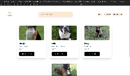

# Paws&Claws
_Description: Paws & Claws is a webapp designed to be a simple marketplace for pets_

## Features: 
1. Register a pet, with profile picture
2. Add (poke) a pet to favorites (Pet Picks)
3. Remove a pet from favorites (Pet Picks)
4. Search for a pet by name
5. View profile page of a pet 

## Architecture: 

 - Frontend is a React app served via NGINX. Backend is a Python Flask application.
 - PostgeSQL for Database
 - Entire application stack is dockerized and deployed on a Kubernetes Cluster (AWS EKS), using AWS CloudFormation Scripts
 - Local testing was done on a Minikube cluster.
 - Pipeline is fully automated using CICD tool CircleCI. 

## Kubernetes Cluster (AWS EKS) deployed

[Screenshots](https://github.com/tomlui2010/pawsandclaws/tree/witheks/Screenshots)

## App Demo

